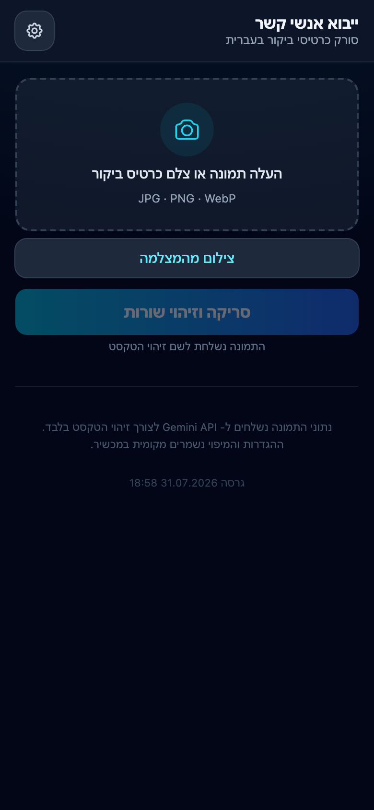
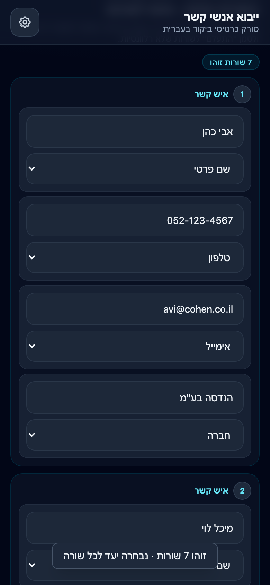

# Contact Importer

A Hebrew business-card scanner PWA. Take a photo of a business card (or paste one), let Gemini extract the text, map each detected line to a contact field, and export a vCard — one card or many cards at once.

## Features

- Scan by photo, camera, or clipboard paste
- Automatic field mapping with per-line dropdowns (first name, last name, phone, email, organization, title, address, notes, custom fields)
- Groups multiple business cards in one photo into separate contacts
- Handles phone prefixes split across lines (e.g. `052` + `1234567`)
- Exports one `.vcf` per contact, or all contacts in a single multi-card file
- Mobile-first, installable PWA with offline support
- iOS import guidance (Save to Files, or share via WhatsApp)

## Screenshots

| Capture | Scan & export |
|---|---|
|  |  |

## Stack

- Static PWA: HTML + Tailwind CSS (CDN) + vanilla JS, service worker for offline
- Vercel serverless function `/api/scan` that calls the Gemini API for OCR
- Gemini model: `gemini-3.6-flash` (free tier, JSON-only output)

## Setup

```bash
npm install
```

The API requires a Gemini API key. Set `GEMINI_API_KEY` (or `GOOGLE_API_KEY`) in your Vercel project settings, or in a local `.env` file for `vercel dev`.

## Development

```bash
npm start
```

Runs `vercel dev` locally.

## Deploy

```bash
npm run deploy
```

Deploys to Vercel. Pushing to `main` also auto-deploys, and a GitHub Action stamps the build version into the app footer on every push.

## How it works

1. The client converts the selected image to a JPEG and sends it to `/api/scan` with the enabled field list.
2. The server asks Gemini to return a JSON array of contacts, each with the detected lines and a suggested field per line.
3. The client renders the lines as editable inputs with per-line dropdowns and merges standalone phone prefixes.
4. On save, the client builds a vCard 3.0 file (with proper CRLF folding, UTF-8 charset, and per-card UIDs) and hands it to the system share sheet or downloads it.
